<div align="center">

# 🍌 BananaMart  
### Aplikasi Web Penjualan Pisang Berbasis Laravel


**Mata Kuliah Pemrograman Web Lanjut**  
**Program Studi Teknik Informatika**  
**Fakultas Teknik**  
**Universitas Malikussaleh**

</div>

---

## 📌 Deskripsi Singkat

**BananaMart** adalah aplikasi web penjualan pisang yang dikembangkan menggunakan framework Laravel sebagai bentuk implementasi materi pada mata kuliah **Pemrograman Web Lanjut**. Aplikasi ini dirancang untuk mendigitalisasi proses penjualan, pengelolaan produk, transaksi pembelian, pemantauan data melalui dashboard, pengaturan hak akses pengguna, serta pembuatan laporan dalam format PDF dan Excel. [file:1428]

Secara fungsional, BananaMart menyediakan dua jenis pengguna, yaitu **admin** dan **user**, yang masing-masing memiliki hak akses berbeda. Admin berperan dalam pengelolaan sistem, sedangkan user berperan sebagai pembeli yang dapat melihat produk, melakukan transaksi, dan memantau riwayat pembelian. Pemisahan role ini merupakan bagian penting dari kebutuhan sistem agar pengelolaan data menjadi lebih aman, terstruktur, dan sesuai dengan skenario aplikasi penjualan modern. [file:1428]

---

## 👨‍🎓 Identitas Mahasiswa

| Keterangan | Detail |
|---|---|
| **Nama** | Muhammad Rafli Daffa Aulia |
| **NIM** | 240170160 |
| **Mata Kuliah** | Pemrograman Web Lanjut |
| **Program Studi** | Teknik Informatika |
| **Fakultas** | Fakultas Teknik |
| **Universitas** | Universitas Malikussaleh |

---

## 🎯 Latar Belakang

Perkembangan teknologi informasi mendorong proses penjualan untuk beralih dari sistem manual menuju sistem digital yang lebih cepat, akurat, dan mudah dikelola. Dalam konteks ini, BananaMart dikembangkan sebagai simulasi sistem penjualan berbasis web yang dapat membantu proses pengelolaan data produk, transaksi, dan laporan penjualan secara terintegrasi.

Melalui project ini, berbagai konsep yang dipelajari dalam perkuliahan diimplementasikan secara nyata, seperti autentikasi pengguna, CRUD, manajemen role, dashboard, REST API, export laporan, hingga desain responsif. Dengan demikian, BananaMart tidak hanya menjadi aplikasi penjualan sederhana, tetapi juga menjadi media pembelajaran untuk menerapkan arsitektur aplikasi web modern menggunakan Laravel. [file:1428]

---

## 🧠 Tujuan Pembuatan Aplikasi

Project BananaMart dibuat dengan tujuan berikut:

- Mengimplementasikan materi Pemrograman Web Lanjut ke dalam project nyata berbasis Laravel.
- Membangun sistem penjualan online sederhana dengan konsep role-based access control.
- Mempermudah pengelolaan data produk dan transaksi secara digital.
- Menyediakan dokumentasi project yang lengkap sebagai bagian dari penilaian UAS.
- Menampilkan kemampuan integrasi fitur backend, frontend, database, dan dokumentasi dalam satu aplikasi. [file:1428]

---

## ✨ Fitur Utama

| Fitur | Penjelasan |
|---|---|
| 🔐 Autentikasi Pengguna | Sistem login dan registrasi untuk mengamankan akses aplikasi |
| 📧 Verifikasi Akun | Mendukung verifikasi email atau autentikasi sesuai implementasi |
| 📦 CRUD Produk | Admin dapat menambah, melihat, mengubah, dan menghapus produk |
| 🧾 CRUD Transaksi | Data transaksi dapat dikelola dan dimonitor |
| 👥 Role Admin & User | Setiap role memiliki hak akses yang berbeda |
| 📊 Dashboard | Menampilkan ringkasan informasi dan statistik sederhana |
| 📑 Export PDF & Excel | Laporan transaksi dapat diekspor sesuai kebutuhan |
| 🔗 REST API | Menyediakan endpoint API untuk pengujian dengan Postman |
| 📱 Responsive Design | Tampilan optimal pada desktop maupun perangkat mobile |

Fitur-fitur tersebut sejalan dengan komponen yang diwajibkan dan dianjurkan dalam ketentuan tugas UAS, seperti autentikasi, CRUD, role, dashboard, export laporan, responsive design, serta dokumentasi README. [file:1428]

---

## 👥 Hak Akses Pengguna

### 1. Admin
Admin memiliki hak akses penuh terhadap sistem, antara lain:
- Mengelola data produk
- Mengelola data transaksi
- Melihat dashboard
- Mengubah status transaksi dan pembayaran
- Mengakses fitur export laporan
- Melakukan monitoring keseluruhan sistem

### 2. User
User memiliki hak akses terbatas sesuai fungsi pembeli, yaitu:
- Login ke sistem
- Melihat daftar produk
- Melakukan pembelian
- Mengunggah bukti pembayaran
- Melihat riwayat transaksi
- Melihat detail struk transaksi

Pemisahan hak akses ini penting untuk menjaga keamanan data, mencegah penyalahgunaan fitur, dan memastikan setiap pengguna hanya dapat menjalankan fungsi sesuai perannya. [file:1428]

---

## 🛠️ Teknologi yang Digunakan

Project ini dibangun menggunakan teknologi berikut:

- **PHP** sebagai bahasa pemrograman utama
- **Laravel** sebagai framework backend
- **MySQL** sebagai database
- **Blade Template Engine** untuk tampilan antarmuka
- **JavaScript** untuk interaksi antarmuka
- **Postman** untuk pengujian REST API
- **DomPDF / Laravel Excel** untuk fitur export laporan

Pemilihan Laravel pada project ini memungkinkan pengembangan aplikasi menjadi lebih terstruktur karena Laravel menyediakan sistem routing, middleware, validation, ORM, dan Blade templating yang mendukung pengembangan aplikasi web modern secara efisien. [file:1428]

---

## ⚙️ Cara Instalasi Project

Ikuti langkah berikut untuk menjalankan project secara lokal:

### 1. Clone repository
```bash
git clone https://github.com/username/bananamart.git
cd bananamart
```

### 2. Install dependency
```bash
composer install
```

### 3. Salin file environment
```bash
cp .env.example .env
```

### 4. Generate application key
```bash
php artisan key:generate
```

### 5. Atur konfigurasi database pada file `.env`
```env
DB_CONNECTION=mysql
DB_HOST=127.0.0.1
DB_PORT=3306
DB_DATABASE=bananamart
DB_USERNAME=root
DB_PASSWORD=
```

### 6. Jalankan migrasi dan seeder
```bash
php artisan migrate --seed
```

### 7. Hubungkan storage ke public
```bash
php artisan storage:link
```

### 8. Jalankan server Laravel
```bash
php artisan serve
```

### 9. Akses aplikasi di browser
```text
http://127.0.0.1:8000
```

README yang efektif sebaiknya menyediakan langkah instalasi yang jelas, berurutan, dan siap salin agar project mudah dijalankan ulang oleh pembaca atau penguji. [web:1479][web:1486]

---

## 🔑 Akun Demo

| Role | Email | Password |
|---|---|---|
| **Admin** | `admin@bananamart.test` | `password123` |
| **User** | `pengguna1@gmail.com` | `pengguna1123` |

---

## 🧩 Penjelasan Fitur Sistem

### 🔐 Autentikasi Pengguna
Sistem autentikasi berfungsi untuk memastikan bahwa hanya pengguna yang terdaftar yang dapat mengakses fitur tertentu. Dengan fitur ini, keamanan aplikasi menjadi lebih baik karena akses terhadap dashboard, transaksi, dan pengelolaan data tidak dapat dilakukan oleh sembarang pengguna. [file:1428]

### 📦 CRUD Produk
Fitur CRUD produk memungkinkan admin untuk menambahkan data produk pisang, mengubah informasi produk, memperbarui stok, serta menghapus produk yang tidak lagi dijual. Fitur ini menjadi inti dari aplikasi karena data produk merupakan dasar dari seluruh proses transaksi. [file:1428]

### 🧾 CRUD Transaksi
Fitur transaksi memungkinkan user melakukan pembelian produk, memilih metode pembayaran, mengunggah bukti pembayaran, dan melihat status transaksi. Dari sisi admin, transaksi dapat dipantau dan diperbarui statusnya agar alur pembelian menjadi lebih realistis seperti pada sistem toko online. [file:1428]

### 📊 Dashboard
Dashboard dirancang untuk menampilkan informasi ringkas mengenai kondisi aplikasi, seperti jumlah produk, total transaksi, serta data penting lainnya. Fitur ini membantu admin dalam memantau aktivitas sistem secara cepat tanpa harus membuka seluruh halaman data satu per satu. [file:1428]

### 👥 Manajemen Role
Penerapan role admin dan user dilakukan untuk membatasi hak akses sesuai kebutuhan. Admin memiliki kontrol penuh terhadap pengelolaan sistem, sementara user hanya dapat menggunakan fitur yang berkaitan dengan proses pembelian dan riwayat transaksi. [file:1428]

### 📑 Export Laporan
Fitur export laporan memungkinkan data transaksi diunduh ke dalam format **PDF** dan **Excel**. Fitur ini sangat berguna untuk dokumentasi, pelaporan, serta kebutuhan administrasi data penjualan. [file:1428]

### 🔗 REST API
REST API disediakan untuk menampilkan data tertentu secara terstruktur dalam format JSON dan untuk mendukung pengujian endpoint menggunakan Postman. Fitur ini menunjukkan bahwa aplikasi tidak hanya mendukung antarmuka web, tetapi juga dapat dikembangkan untuk integrasi sistem lain. [file:1428]

### 📱 Responsive Design
Antarmuka BananaMart dirancang responsif agar tetap nyaman digunakan baik pada layar desktop maupun perangkat mobile. Responsivitas penting agar aplikasi tetap dapat diakses secara optimal dalam berbagai ukuran layar. [file:1428]

---

## 🖼️ Dokumentasi Screenshot

> Semua screenshot dokumentasi disimpan di folder `Screenshot/`.

### 1. Halaman Login
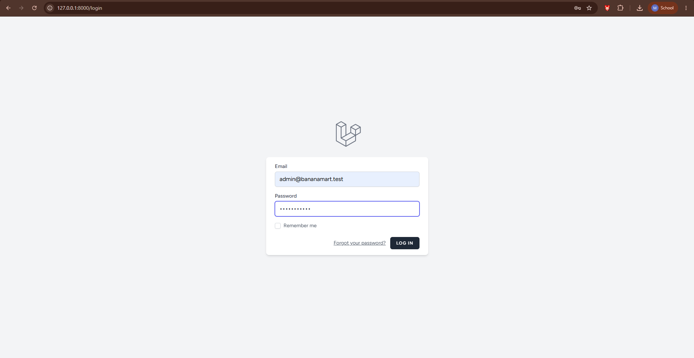

### 2. Halaman Registrasi
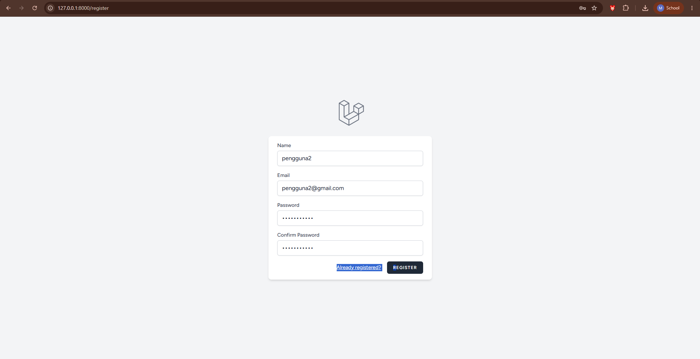

### 3. Verifikasi Email / Autentikasi


### 4. Dashboard Admin
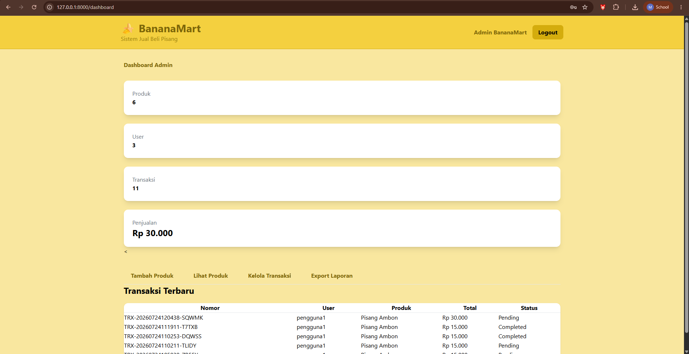

### 5. Dashboard User
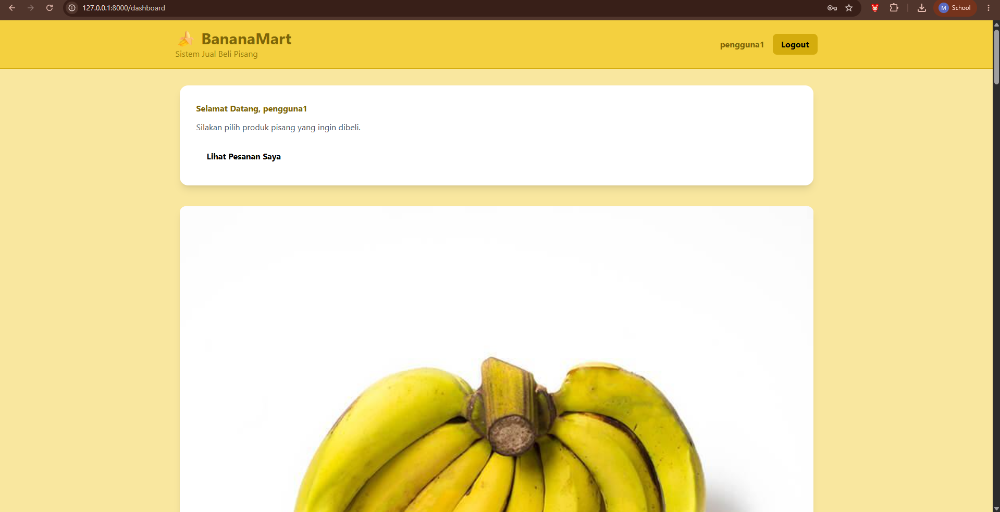

### 6. CRUD Produk
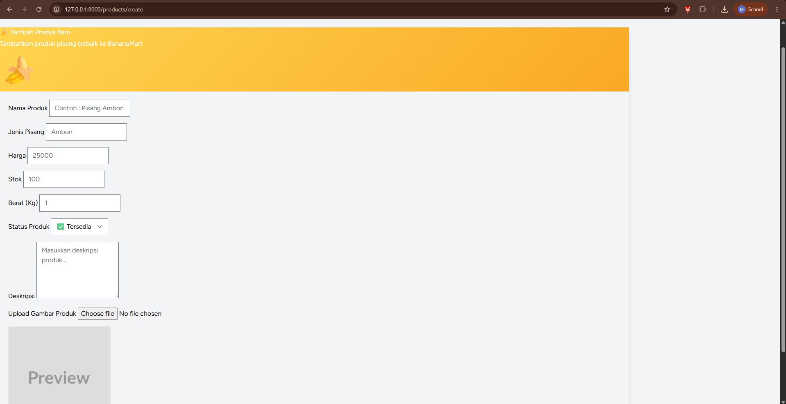

### 7. CRUD Transaksi
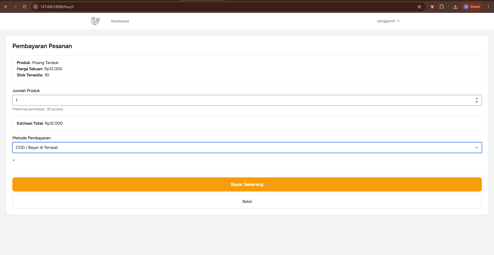

### 8. Role Admin dan User


### 9. REST API di Postman
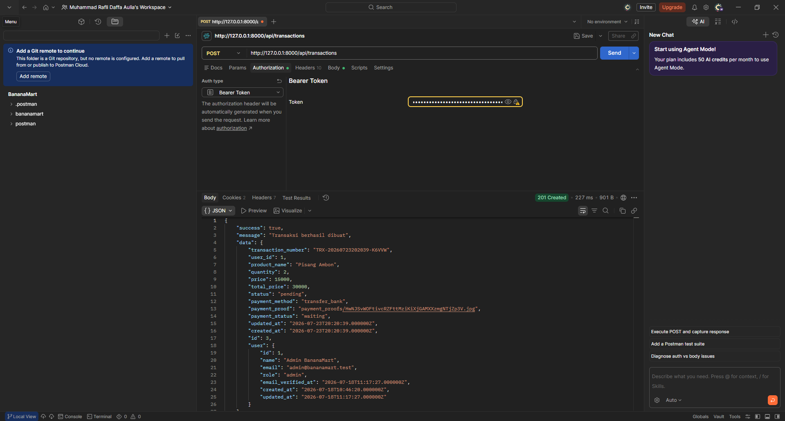

### 10. Tampilan Responsive Desktop
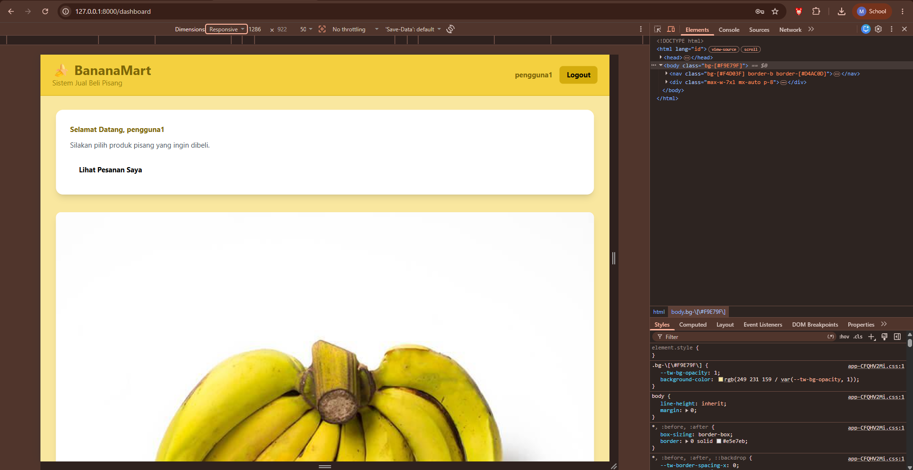

### 11. Tampilan Responsive Mobile
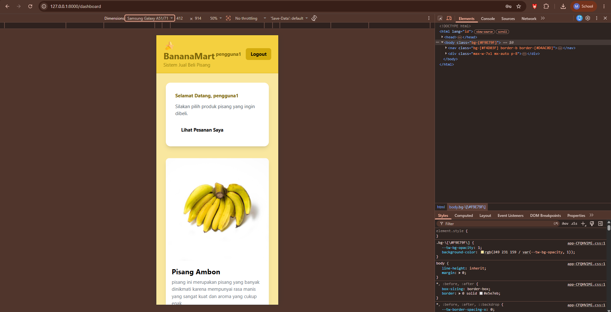

### 12. Export PDF
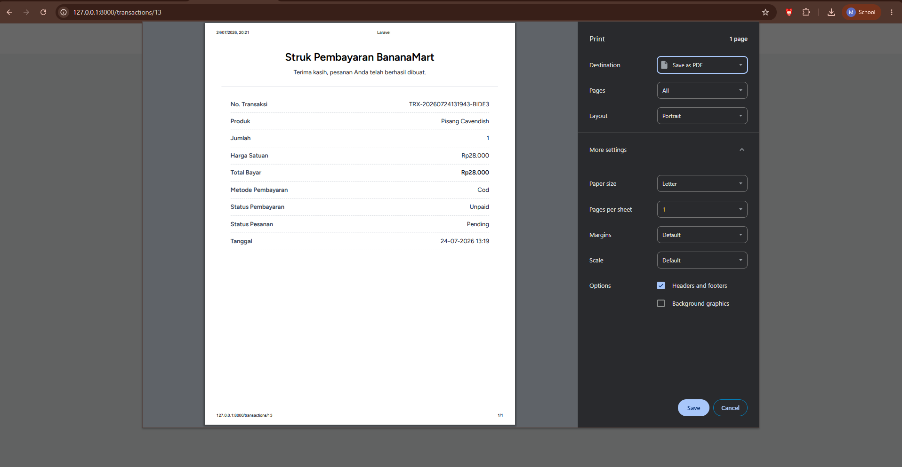

### 13. Export Excel
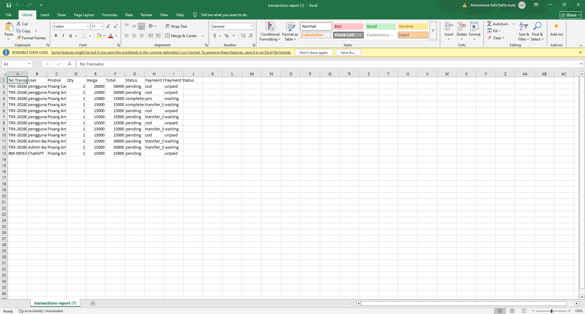

README yang baik sebaiknya memuat dokumentasi visual untuk menunjukkan bahwa fitur benar-benar telah berjalan, dan gambar di README GitHub perlu memakai path relatif yang sesuai agar tampil dengan benar. [web:1480][web:1485]

---

## 📁 Struktur Folder Dokumentasi

```text
bananamart/
├── app/
├── Screenshot/
│   ├── login.png
│   ├── register.png
│   ├── dashboardadmin.png
│   ├── dahsboarduser.png
│   ├── crud.png
│   ├── crudtransaksi.png
│   ├── postman.png
│   ├── responsive1.png
│   ├── responsive.png
│   ├── export-pdf.png
│   └── exportexcel1.png
├── resources/
├── routes/
└── README.md
```

---

## 🔗 Endpoint API Contoh

| Method | Endpoint | Keterangan |
|---|---|---|
| `GET` | `/api/products` | Menampilkan daftar produk |
| `POST` | `/api/products` | Menambahkan produk baru |
| `GET` | `/api/transactions` | Menampilkan daftar transaksi |
| `POST` | `/api/transactions` | Membuat transaksi baru |

> Endpoint dapat disesuaikan kembali dengan route API yang aktif pada project.

---

## 🌟 Kelebihan Aplikasi

Beberapa kelebihan BananaMart antara lain:

- Mampu mengelola penjualan pisang secara digital
- Memiliki struktur fitur yang sesuai kebutuhan tugas UAS
- Menerapkan autentikasi dan pemisahan role pengguna
- Mendukung proses transaksi dan pelacakan pembayaran
- Menyediakan dashboard sebagai pusat informasi
- Memiliki export laporan PDF dan Excel
- Menyediakan REST API untuk pengembangan lanjutan
- Mendukung tampilan responsif untuk berbagai perangkat [file:1428]

---

## 📝 Kesimpulan

BananaMart merupakan implementasi aplikasi web penjualan yang dibangun sebagai bentuk penerapan materi pada mata kuliah Pemrograman Web Lanjut. Melalui project ini, konsep-konsep penting seperti autentikasi, CRUD, role management, dashboard, export laporan, REST API, dan responsive design berhasil diterapkan dalam sebuah sistem yang terstruktur dan fungsional. [file:1428]

Selain sebagai pemenuhan tugas UAS, project ini juga menjadi bukti kemampuan dalam merancang, membangun, dan mendokumentasikan aplikasi berbasis Laravel secara utuh, mulai dari sisi backend, frontend, database, hingga dokumentasi GitHub. README yang lengkap dan terstruktur seperti ini membantu pembaca memahami nilai, tujuan, dan cara penggunaan project dengan lebih cepat. [web:1479][web:1486]

<div align="center">

### 🍌 BananaMart  
**Digitalisasi Penjualan Pisang dengan Laravel**

</div>